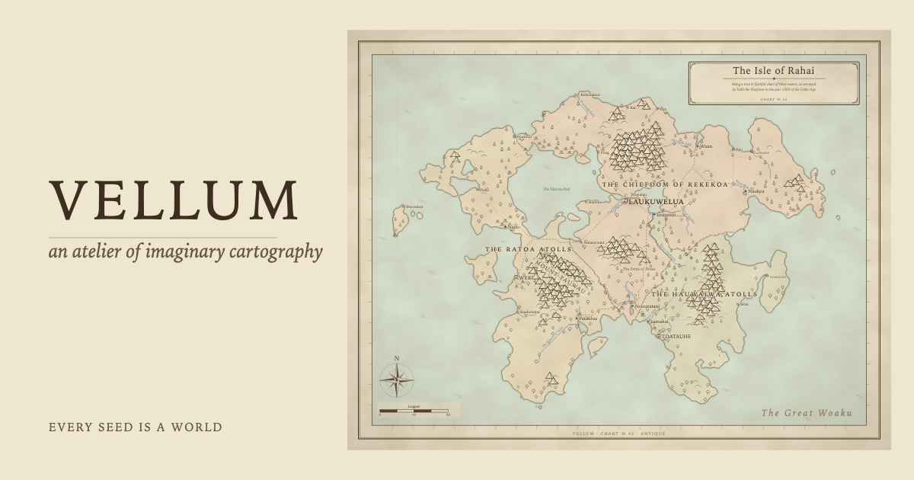

# Vellum

*An atelier of imaginary cartography.*

[](https://github.com/ahl-gram/Vellum/actions/workflows/ci.yml)



**Vellum lives at <https://vellum.route12b.net/>.** No install, no account:
the whole engine runs client-side in your browser.

Vellum surveys worlds that don't exist and drafts them as atlas charts.
Give it a seed and it invents a landmass, simulates the rain that carves its
rivers, grows its forests, founds its harbor towns, names everything in
one of ten invented languages, and partitions the land into quarrelsome
realms. Then Vellum sits down at the drafting table and draws the maps,
complete with parchment texture, hatched mountain ranges, a compass
rose, a sea serpent, and a title cartouche.

| Room | What happens there |
|---|---|
| **[Explorer](https://vellum.route12b.net/explorer/)** | Type a seed, draw its world, zoom into its regions |
| **[Print Room](https://vellum.route12b.net/print-room/)** | Poster-size SVG or PNG of any seed, print the bound atlas to PDF, download a self-contained atlas |
| **[Seed of the Day](https://vellum.route12b.net/seed-of-the-day/)** | Today's world, the same for everyone, plus the Daily Hunt |
| **[Atlas](https://vellum.route12b.net/atlas/)** | The hero world (seed 42) as a bound volume |
| **[Gallery](https://vellum.route12b.net/gallery/)** | A twelve-world contact sheet |
| **[Q & A](https://vellum.route12b.net/faq/)** · **[Glossary](https://vellum.route12b.net/glossary/)** | How it all works; the vocabulary printed on the charts |

The daily seed is the current UTC date read as an integer `YYYYMMDD`, so
everyone sees the same world on the same calendar day, and the page never
needs a rebuild: it draws itself in your browser when you load it.

## Same seed, same world

Every chart is reproducible from the number printed in its corner. The root
`<svg>` embeds its full recipe as `data-vellum-*` attributes, and re-rendering
that recipe reproduces the map byte for byte. The
[Q & A](https://vellum.route12b.net/faq/) covers seeds, determinism, and how to
reproduce a saved chart in detail.

## The styles

- **antique**: parchment, waterlined coasts, hatched mountain glyphs,
  tree fields, realm tints, rhumb lines, cartouche, sea monsters.
- **topographic**: hypsometric tints, shallow-water bands, contour
  lines, cased red roads. A modern survey plate.
- **ink**: monochrome pen-and-ink linework.
- **nautical**: white-water sea chart with fathom soundings scattered over
  open water, a shoal tint out to the dashed danger line, rock-awash
  marks, prevailing-wind arrows, navy linework, prominent rhumb lines.

## How a world gets made

Each stage is a pure function of the stage before it, and every random
choice comes from a labeled fork of the master seed (`fork("names")`,
`fork("sites")` …), so adding a stage never reshuffles the others.

1. **Terrain**: domain-warped fractal gradient noise with a ridged
   component, shaped by map-type falloff. Sea level is chosen by
   quantile so the land fraction always hits its target.
2. **Hydrology**: priority-flood depression filling guarantees every
   land cell drains to the ocean; D8 steepest descent + moisture-
   weighted rain accumulate into rivers with tapered widths and
   tributary junctions.
3. **Climate & biomes**: latitude + elevation lapse temperature,
   coast/river-distance moisture, a Whittaker-style biome matrix with
   alpine and shoreline overrides.
4. **Society**: settlements scored by harbors, river mouths, and flat
   fertile land; roads grown by Dijkstra with a reuse discount so trunk
   corridors emerge; realms partitioned by terrain-cost Voronoi, with
   borders that prefer ridges and rivers.
5. **Names & lore**: syllable-grammar generators for ten invented
   cultures name every town, river, sea, and realm; a template-grammar
   lore writer drafts the gazetteer notes.
6. **Rendering**: marching-squares coastlines and contours (with
   saddle resolution and boundary closing), Chaikin smoothing, a tiny
   immutable SVG builder, and ~15 layer renderers up through the
   parchment-texture overlay (`feTurbulence`) and frame.

**Regional zoom** falls out of the architecture: elevation is a
continuous function of world-space coordinates, so the atlas's
"Environs of …" charts re-sample the same world through a smaller
window at finer resolution; coastlines, mountains, and settlements all
line up with the world chart.

## Inventing a name language

Each of the ten name cultures is a plain data object (the `Culture` type in
`src/society/names.ts`): three sound inventories (onsets, nuclei, codas), the
syllable patterns that combine them, and the templates that dress a bare stem
into "The Sea of %" or "Mount %". Retune one, or add your own to lean a
world's names toward any sound you like. It is phonotactic mimicry, not
linguistics: a culture captures the shape and sound of a language, never its
grammar or meaning.

One warning: names come from a labeled fork of the seed, so editing the
cultures renames every world. A naming change re-rolls existing seeds, owes a
hero-chart regen (`npm run charts:regen` + `npm run og`), and must respect the
**covenant seed**: seed 42's culture pick must keep landing on oromi across
roster changes, so the golden world's every name stays bit-identical.
`test/world/covenant-seed42.test.ts` fails loudly if it ever moves.

## Run it locally

```bash
git clone https://github.com/ahl-gram/Vellum
cd Vellum
npm install
npm run dev        # the full site, Explorer included, on a local Astro dev server
```

Vellum needs **Node 24+**.

### The CLI

The engine is also a command-line tool that draws one chart at a time, straight
from the TypeScript source with no build step:

```bash
npm run chart -- --seed 42                     # → out/chart-42-antique.svg
npm run chart -- --seed 42 --style nautical    # a different drafting table
npm run chart -- --seed 42 --theme moisture    # a thematic data plate (rainfall)
node src/cli/main.ts help                      # the full flag reference
```

Charts land in `out/` (gitignored) as plain SVGs: open them in a browser, drop
them into a document, or add `--png` to rasterize. The help screen documents
every flag (styles, map types, climate bands, coastline raggedness, legends,
coats of arms, PNG export).

## Development notes

Built test-first for the algorithmic core (RNG, noise, marching
squares, flow, rivers, biomes, names, placement) with structural tests
pinning the renderer's contract (layer ids, balanced tags, no NaN,
byte-determinism). Aesthetics were iterated with a screenshot loop:
render SVG → headless-browser PNG → look at the map → adjust.

A few favorite emergent behaviors, none individually programmed:

- Lakes: priority-flood treats below-sea-level depressions as water,
  so inland lakes appear with their own waterlined shores, and the largest
  earn names (*The Bairasha Basin*).
- Estuaries: rivers widen toward their mouths because accumulation
  grows monotonically downstream.
- Mountain passes: roads thread between glyph ranges because slope is
  the dominant Dijkstra cost.
- Realm borders follow rivers and ridgelines because crossing them
  costs extra.

## License

Vellum's source code is released under the [MIT License](LICENSE).

Maps you generate with Vellum are dedicated to the public domain (CC0): use
them for anything, including commercial work, with no restrictions and no
attribution required.

---

## For contributors

The repository is two things: a dependency-light world engine, and the Astro
site that serves it.

- **The engine** (the `src/` world/render/atlas tree) has zero runtime
  dependencies. Node 24+ runs its TypeScript directly (`erasableSyntaxOnly`),
  no build step, and the CLI and tests run the same way.
- **The site** takes dependencies where they earn their keep. All seven pages
  (home, Q & A, Glossary, Explorer, Print Room, Seed of the Day, Gallery) are
  Astro pages rendered through one shared layout (`src/pages/` + `src/layouts/`); the app
  surfaces' code is TypeScript in `src/site/`, one language with the engine it
  imports. One bundler, Vite, compiles the app and engine graph together into
  the three app entries and the shared render worker, which is where the
  runtime deps (`d3-selection`, `d3-transition`, `d3-zoom`) ship. `public/`
  holds only static assets (goldens, fonts, per-page CSS, favicon). Dev deps:
  `astro`, `typescript`, `@types/node`, `@types/d3-*`, `vite`.
- **The build** (`npm run build`): `astro:generate` first writes the generated
  trees into `public/` (the Vite app bundles, the atlas and gallery
  showcases), then `astro build` assembles `dist/`, which GitHub Actions
  publishes to Pages on every push to main.

Day to day: `npm test` (unit), `npm run check` (typecheck), `npm run test:e2e`
(headless-browser suite against a built `dist/`; needs a Chromium-family
browser), `npm run dev` (local site).

### Committed goldens

The homepage's seven hero charts (`public/charts/*.svg`) and the social
card (`public/og.png`, 1200x630, rebuilt by `npm run og` with an installed
browser) are committed rather than generated at deploy time, because CI has no
browser and the homepage pins its heroes. `npm run charts:regen` is their only
writer; land a regen alone, with the label moves named in the PR.
`public/favicon.svg` is the hand-drawn compass-rose mark, linked from every
page.
